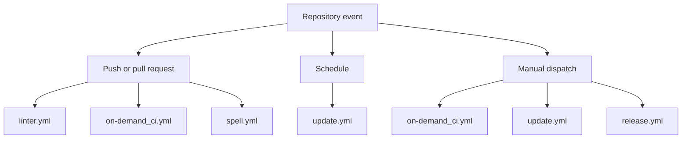

# Available workflows

This directory contains the GitHub Actions workflows currently used by this repository. They cover repository validation, docs quality checks, scheduled maintenance, and release automation.

## Quick context

- `CI:` [linter.yml](./linter.yml) validates the repository on pushes and pull requests with repository linting, broken-link checks, and AI-assisted failure analysis when validation fails.
- `CI:` [on-demand_ci.yml](./on-demand_ci.yml) runs the Python unit test suite for branch validation and manual execution.
- `Quality:` [spell.yml](./spell.yml) checks spelling in Markdown files and documentation-heavy pull requests.
- `Maintenance:` [update.yml](./update.yml) refreshes managed version files and opens a pull request with the resulting updates.
- `Release:` [release.yml](./release.yml) delegates to the shared release workflow to generate changelog metadata and publish a GitHub release.

## Execution map

<!-- markdownlint-disable MD013 -->

| Workflow file                          | Purpose                                                                                                                                                              | Trigger                                     |
| -------------------------------------- | -------------------------------------------------------------------------------------------------------------------------------------------------------------------- | ------------------------------------------- |
| [linter.yml](./linter.yml)             | Runs repository linting and static analysis checks with `super-linter`, verifies documentation links, and uses AI-assisted diagnosis to explain validation failures. | `push`, `pull_request`                      |
| [on-demand_ci.yml](./on-demand_ci.yml) | Executes the Python unit test suite for the project and validates the default branch policy during pushes and pull requests.                                         | `workflow_dispatch`, `push`, `pull_request` |
| [spell.yml](./spell.yml)               | Verifies documentation spelling with `reviewdog` and `pyspelling` while targeting Markdown-heavy changes.                                                            | `push`, `pull_request_review`               |
| [update.yml](./update.yml)             | Maintenance workflow that refreshes managed version files and opens a pull request with the update set.                                                              | `schedule`, `workflow_dispatch`             |
| [release.yml](./release.yml)           | Publishes the project release process by reusing the shared GitHub workflow for changelog generation and release creation.                                           | `workflow_dispatch`                         |

<!--
markdownlint-enable MD013 -->

## Notes

- The repository currently defines five workflow files in this directory.
- The linter and CI workflows are the main validation gates for branch and pull request checks.
- The spell workflow is focused on documentation quality and catches common terminology issues early.
- The update workflow is the maintenance automation path triggered by schedule or manual dispatch.
- The release workflow is the manual release path for changelog generation and publishing.
- The project keeps workflow automation centralized in this folder so build, docs, and release checks remain easy to audit and maintain.
