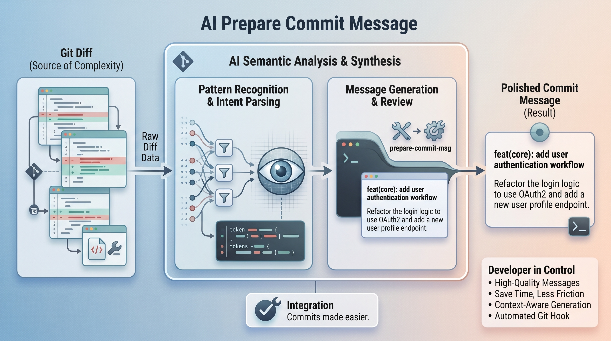

# AI Prepare Commit Message

<!-- markdown-link-check-disable-next-line -->

<!-- markdown-link-check-disable-next-line -->

AI-powered Git hook that generates concise,
high-quality commit messages from your staged changes.

Messages follow the Conventional Commits format
and OpenStack commit-message best practices.

The hook integrates with Git's `prepare-commit-msg` flow
and uses LiteLLM to produce the text.

## Reasons to Use AI Prepare Commit Message

While you can write commit messages manually, AI Prepare Commit Message makes the process faster, more consistent, and easier to integrate into your existing Git workflow.

- **Save time writing commit messages** — Turn staged changes into a useful commit message automatically instead of stopping to summarize the diff yourself.
- **Write better commit messages** — Analyze the actual changes in your staged diff to produce a meaningful description rather than relying on generic summaries.
- **Keep commits consistent** — Follow Conventional Commits and project-specific writing conventions through configurable prompts.
- **Understand large diffs faster** — Let AI identify the important changes in complex diffs and distill them into a concise commit message.
- **Fit naturally into Git** — Integrate directly with Git's prepare-commit-msg lifecycle without requiring a separate application or command.
- **Stay in control** — Generated messages are drafts. Review, edit, or replace them before the commit is finalized.
- **Use different AI providers** — LiteLLM provides a unified interface for different models and providers, allowing you to change models through configuration.
- **Centralize commit conventions** — Define message structure, tone, and formatting rules in prompts instead of relying on every contributor to remember them.
- **Reduce cognitive overhead** — Spend less time translating code changes into prose and more time focusing on the work itself.
  Improve project history — Clear and consistent commit messages make Git history easier to read, search, review, and understand.
