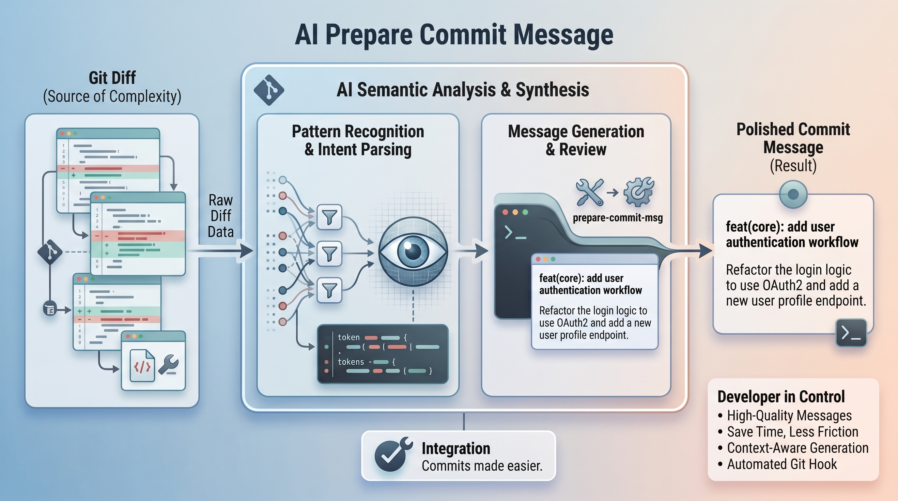

# AI Prepare Commit Message

<!-- markdown-link-check-disable-next-line -->

<!-- markdown-link-check-disable-next-line -->

AI Prepare Commit Message is an AI-powered Git hook that generates concise,
high-quality commit messages from staged changes.
It integrates with Git's `prepare-commit-msg` flow
and uses LiteLLM to produce messages that follow the Conventional Commits format
and OpenStack commit-message best practices.
Headroom compression and map-reduce summarization help it handle large diffs.
Optionally, a [decision model](docs/how-to-guides/decision-models.md)
can choose the Conventional Commit type using Jev or Ollaya.

## How It Works

When a commit starts, the hook reads the staged diff,
compresses or summarizes it when necessary,
and generates a draft commit message.
It presents that draft before writing it to Git,
so Git remains in control of the commit
and the developer remains in control of final approval.

## Why It Helps

Clear commit messages make project history easier to review, search, understand,
and maintain.
They also give developers useful diagnostic context when they troubleshoot changes.
Research does not establish a universal average for the time required to write a
good commit message:
the time varies with the size of the change,
the developer's familiarity with it,
and the level of detail required.
The evidence is stronger on message quality and maintenance effort than on elapsed
writing time.
For example, an IEEE study of more than 23,000 Java projects found that most commit messages
were very short or empty, while only about 10% were descriptive.
It also found that descriptive messages were typically 15 to 20 words long
and that developers preferred automatically generated messages in 62% of large-commit cases
and 54% of small-commit cases.
See [On Automatically Generating Commit Messages via Summarization of Source Code Changes](https://api.crossref.org/works/10.1109/scam.2014.14)
for the study details.

An IEEE survey also describes software fault localization as tedious,
time-consuming, and expensive,
and explains that increasing software scale and complexity make manual issue detection harder.
This supports treating clear change descriptions as useful diagnostic context,
without claiming that every incident has the same investigation time.
See [A Survey on Software Fault Localization](https://api.crossref.org/works/10.1109/tse.2016.2521368)
for the research background.

## Key Capabilities

- **Configurable prompts** — Define message structure, tone, and formatting rules for your project.
- **Multiple AI providers** — Change models and providers through LiteLLM configuration.
- **Custom providers** — Register a corporate gateway or self-hosted backend through a Python entry point.
- **Decision models** — Choose the Conventional Commit type with Jev or Ollaya.
