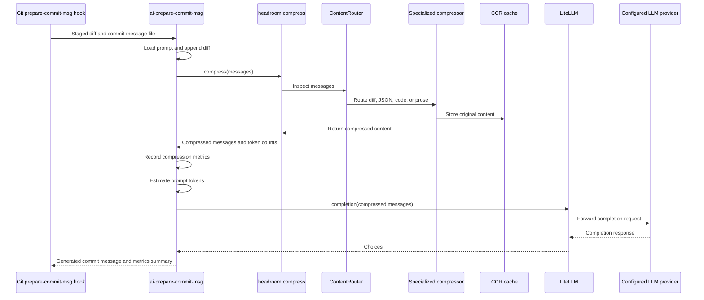
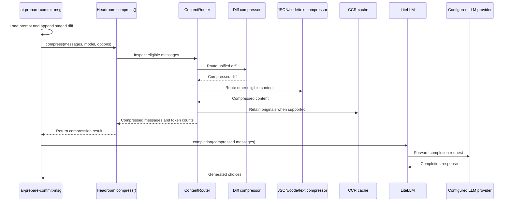

# Headroom prompt compression

This project uses [Headroom](https://github.com/chopratejas/headroom)
to reduce the tokens sent with LLM requests.
It does not replace the selected model or provider.
Instead, the project compresses the prompt in-process
and hands the compressed messages to LiteLLM.

## Why it is used here

Generating a commit message sends the configured prompt and the staged Git diff to the model.
Large diffs can make requests expensive or exceed a model's context limit.
Headroom reduces the request size,
while the project retains its own 120,000-token preflight guard and oversized-prompt fallback.

For a unified diff,
Headroom keeps every added and removed line
and trims surrounding context lines and redundant headers,
so the model still sees the actual change.

## How this project enables it

[`src/ai_prepare_commit_msg/llm.py`](../../src/ai_prepare_commit_msg/llm.py)
imports `headroom.compress.compress` when the optional dependency is importable.
Before estimating tokens,
`get_commit_msg` calls `_compress_messages()`.
That function:

1. Returns the original messages when Headroom is not installed.
2. Calls `compress()` with `compress_user_messages=True` and `protect_recent=0`.
3. Records the reported token counts in a process-wide `CompressionStats` accumulator.
4. Returns the original messages when compression raises or reports no token counts.

The `compress_user_messages` and `protect_recent` options matter.
Headroom's defaults protect user messages and the most recent turns,
which is the right behavior for a multi-turn coding agent.
The staged diff in this tool is a single trailing user message,
so the defaults would leave it untouched and save nothing.

Compression must run on the request path rather than through a LiteLLM callback.
Headroom's `HeadroomCallback` compresses inside `async_pre_call_hook`,
which LiteLLM invokes only in proxy mode,
so registering it has no effect on the synchronous `litellm.completion()` call this project makes.



## Token savings metrics

`CompressionStats` accumulates the token counts Headroom reports for every request in a run,
including retries.
It exposes `tokens_before`, `tokens_after`, `tokens_saved`, and `savings_ratio`.

The CLI prints the summary to standard error before asking for confirmation:

```console
Headroom: 2395 -> 2131 prompt tokens over 1 request(s); saved 264 (11.0%).
```

When Headroom is unavailable or every compression attempt failed,
no request is recorded and the CLI prints:

```console
Headroom: prompt compression unavailable; no token metrics collected.
```

The counts come from Headroom's own tokenizer for the configured model.
They describe prompt tokens only,
so they do not account for completion tokens or provider-side prompt caching.

## How Headroom works internally

Headroom is an inline message-compression layer.
It inspects the messages before the provider request,
routes eligible content to specialized compressors,
and returns a smaller message list to the caller.
The model and provider remain unchanged.

### What gets compressed

Headroom does not apply compression uniformly to every message.
Its message policy distinguishes content that can be reduced from content that should remain stable:

- **System messages** are normally left unchanged.
- **User messages** are protected by default,
  but this project sets `compress_user_messages=True`
  because the staged diff is the trailing user message that carries the work to summarize.
- **Recent messages** are normally protected in a multi-turn conversation,
  but this project sets `protect_recent=0`
  because each commit-message request is a short, single-turn interaction.
- **Assistant and tool output** can be routed to the appropriate compressor when present.

For a unified diff,
the diff-aware compressor keeps every added and removed line
and trims surrounding context lines and redundant headers.
This preserves the change itself while reducing material that is less useful for generating the commit message.

### The ContentRouter pipeline

Headroom routes eligible content by its shape rather than applying one algorithm to everything:

| Content         | Typical compressor | Purpose                                       |
| --------------- | ------------------ | --------------------------------------------- |
| Unified diffs   | Diff compressor    | Keep changes and trim redundant context.      |
| Structured JSON | SmartCrusher       | Remove redundant nesting and repeated fields. |
| Source code     | AST-aware code     | Remove comments and normalize whitespace.     |
| Logs and prose  | Semantic text      | Retain key facts and remove filler wording.   |

The conceptual phases are:

1. Inspect each eligible message and identify whether it contains a diff, JSON, code, logs, or prose.
2. Route the content to the specialized compressor for that content type.
3. Preserve the compressed content in its original message position.
4. Retain the original content in the CCR cache when retrieval is supported.
5. Return the compressed message list and token counts to the caller.

The compressor may report the original and compressed prompt-token counts.
This project records those counts in `CompressionStats`
and uses the compressed messages for both its final token estimate and its LiteLLM request.

Original content can be retained in Headroom's Cacheless Compression Retrieval cache.
When a model needs the uncompressed content later,
it can retrieve that original through `headroom_retrieve`
rather than requiring every message to remain uncompressed.

The cache is an internal Headroom capability,
not a storage layer managed by this project.
This repository does not issue retrieval calls,
inspect cache keys,
or control cache lifetime.

This repository delegates those implementation decisions to Headroom.
It does not choose a compressor,
run a local proxy,
set compression budgets,
or validate that compressed content preserves meaning.

### Pipeline behavior in this project

The request path is:



If compression is unavailable,
raises an exception,
or does not return usable token counts,
the project uses a copy of the original messages and continues with LiteLLM.
This fail-open behavior protects commit-message generation,
but it also means a failed compression attempt produces no savings for that request.

## Failure behavior and limits

The dependency list includes `headroom-ai`,
but the import is guarded so a missing dependency leaves the normal LiteLLM path available.
The project logs that condition at debug level and continues without prompt compression.
Compression errors are logged as warnings and fall back to the original messages.

Headroom is not a substitute for the project's context protections.
Before calling LiteLLM,
the project estimates the full prompt and declines requests above 120,000 tokens.
It also recognizes provider context-limit errors and returns a message telling the user to write the commit message manually.

Headroom reduces token volume only when it can compress eligible content.
It cannot guarantee lower cost,
and it does not reduce model output tokens.
Treat it as an optimization layer around the existing request path,
not as a guarantee that arbitrarily large staged diffs will fit into a model context window.

## Verification

[`tests/test_llm.py`](../../tests/test_llm.py) verifies the compression paths:

- When Headroom is available,
  the compressed messages are used and the token savings are recorded.
- When Headroom is unavailable,
  the original messages are returned and no metrics are recorded.
- When compression raises,
  the original messages are returned and no metrics are recorded.

The tests cover this project's compression and metrics behavior.
They do not measure real token savings
or validate the semantic fidelity of compressed prompts.
