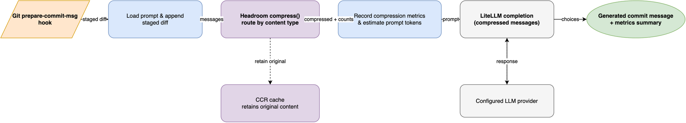

# Headroom prompt compression

This project can optionally compress the prompt before it reaches LiteLLM.
The feature is not required for correctness,
but it helps when the staged diff is large enough to be costly or close to a model's context limit.

## Why this exists

The main request contains two things:
the prompt policy and the staged diff.
When the diff is large,
compression removes low-value context while keeping the actual change set intact.
The project still enforces its own token budget and rejects requests that remain too large.

Headroom is therefore an optimization layer,
not the core model interface.
If the dependency is absent or compression fails,
the hook continues with the original messages.

## What the project does

The project calls `headroom.compress.compress()` when the optional dependency is available.
It sets `compress_user_messages=True` and `protect_recent=0`,
which is important for this workflow:
the staged diff is the final user message and should be the part that is reduced.

The request path is:

1. Build the LiteLLM message list.
2. Run a preflight token estimate.
3. Compress the message list when Headroom is available.
4. Re-estimate the final prompt length.
5. Proceed only if the result is within the project's guardrail.



## What gets preserved

Headroom reduces redundant and low-signal content,
but the diff-aware compressor keeps the changed lines themselves.
In practice that means the model still sees:

- added and removed lines
- file-level change type information
- the meaningful structure of the patch

It trims surrounding context, repeated headers, and less valuable boilerplate.

## Token metrics and fallback

The project records token counts before and after compression.
Those values are printed in the CLI output when available,
for example:

```console
Headroom: 2395 -> 2131 prompt tokens over 1 request(s); saved 264 (11.0%).
```

If compression is unavailable or throws an error,
the hook falls back to the original messages without failing the commit flow.
This is intentional: the feature is a cost-saving optimization, not a required dependency.

## Limits

Headroom does not replace the project's guardrails.
The final token check still enforces the maximum prompt budget,
and the system still stops on provider context-limit errors.

This keeps the project safe:
Headroom can reduce cost for large diffs,
but it cannot guarantee that an arbitrarily large diff will fit into any model context.

## Related topic

For the larger diff-handling process,
see [Large diff summarization chain](summarization-chain.md).
