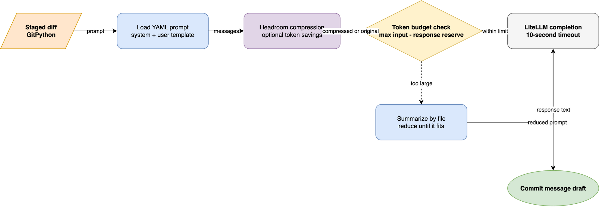

`ai-prepare-commit-msg` connects Git's `prepare-commit-msg` lifecycle
to a language model through LiteLLM.

The design goal is simple:
you keep your normal commit flow,
and the tool proposes a high-quality draft based on staged changes.

## Lifecycle Integration

Git runs `prepare-commit-msg` before the commit message editor opens.
This project uses that moment to inspect staged diffs,
send a prompt to the selected model,
and write a suggested commit message to the commit message file.

You stay in control.
The generated output is a draft,
and you can edit it before the commit is finalized.

## The Execution Flow

The diagram shows the normal path,
including the no-change exit,
oversized-prompt guard,
and retry loop.

When you run `git commit`,
Git invokes the `prepare-commit-msg` hook,
which runs the AI command with your configured model.

The tool then:

1. **Detects staged changes** — The CLI creates a `GitRepository` for the current working directory.
   GitPython reads the cached diff,
   which contains all changes staged for the next commit.
   If no changes are staged,
   the tool exits silently without generating anything.

2. **Guards against oversized prompts** — Estimates the complete prompt with LiteLLM's token counter.
   The safe limit is 120,000 tokens.
   If the estimate is too large,
   the tool first replaces the raw diff with a file-anchored summary.
   Only if that summary is still too large does it skip the model request
   and return a warning.

3. **Constructs the prompt** — Loads a YAML prompt file (default: `prompts/default.yml`)
   containing a system message and user message template.
   Your staged diff becomes the final user message.

4. **Calls the LLM** — Sends all prompt messages to your configured model via LiteLLM
   with a 10-second timeout.
   The request uses a low temperature of 0.1
   to favor consistency over creativity.

5. **Handles retries** — If the model returns an empty response,
   the tool retries up to 5 times (configurable) with a 3-second delay between attempts (configurable).
   This helps recover from transient API failures.

6. **Validates the output** — Extracts text from the model's response,
   supporting multiple response formats (objects with message attributes, dictionaries, strings).

7. **Confirms or auto-approves** — When running interactively, displays the generated message and prompts you to confirm.
   You can accept it (press Enter or Y), reject it (press N), or edit it in the editor.
   With `--auto-approve`, the message is written without confirmation.

8. **Writes to Git** — Persists the commit message to Git's `COMMIT_EDITMSG` path,
   which Git displays in your editor when the hook completes.

## Internal Components

The tool is deliberately small.
The CLI coordinates the operation,
while two helpers own the external boundaries:

- `GitRepository` reads staged content and writes the final message.
- `llm.get_commit_msg()` prepares prompts,
  protects the model request,
  and normalizes the response.

The CLI does not pass individual filenames to the model.
It passes the complete staged diff as the final user message.
The positional `files` argument exists for compatibility with `pre-commit`;
the staged diff remains the source of truth.

## Prompt Construction

The default YAML file supplies two messages:

1. A system message defines the output contract,
   including Conventional Commits,
   imperative headers,
   semantic line breaks,
   and the rule to return only the commit message.
2. A user message introduces the diff.

The implementation appends the actual staged diff to that loaded list.
This keeps the writing policy separate from the runtime data.
You can replace the YAML file with `--prompt-file`
without changing the Git or model integration code.

## Why Providers Are Pluggable

LiteLLM covers the major hosted providers,
but it cannot know about a corporate gateway
or a self-hosted inference server behind a private network.
Rather than accepting backend-specific code and credentials into this project,
the tool reads the `ai_prepare_commit_msg.litellm_providers` entry point group
before the first model call
and registers whatever handlers the environment advertises.

That inversion keeps the integration surface honest.
A provider lives in its owner's package,
ships on its owner's release cycle,
and a plugin that fails to import degrades to a logged warning
rather than a broken commit.
See [Add a custom LLM provider](../how-to-guides/custom-providers.md)
for the procedure.

## How Large Diffs Are Reduced

Prompt compression and diff summarization solve different problems.

**Headroom compression** is an optional first pass over the prompt.
When the `headroom-ai` package is available,
it compresses the messages while protecting the diff's meaningful additions
and removals.
The process records token counts,
and the CLI prints the accumulated savings after a successful generation.
If Headroom is unavailable or fails,
the original messages continue through the pipeline.

If the prompt still exceeds 120,000 tokens,
the summarization chain takes over:

1. The diff is split into sections using each `diff --git` header.
2. The tool derives each file's path,
   change type,
   and added or removed line counts directly from the diff.
3. Lockfiles,
   vendored directories,
   generated files,
   and other low-signal paths contribute deterministic statistics
   but do not consume a summarization request.
4. Each remaining file is summarized independently.
   Very large files are split into token-sized parts first,
   and independent summaries run in parallel with a time limit.
5. A reduce step combines the per-file notes
   until they fit the summarization budget.

The resulting input tells the model both what changed
and where it changed,
without asking it to reconstruct an enormous raw diff.
If the chain cannot produce useful notes,
the original diff is retained;
the final token check then decides whether generation can proceed.

The prompt pipeline separates prompt policy from staged content.
The YAML file supplies the policy,
Headroom optionally reduces token usage,
and the budget check decides whether the raw or summarized input reaches LiteLLM.
The model response then becomes the draft shown for confirmation.

## Response And Failure Boundaries

LiteLLM can return choices as objects,
dictionaries,
or plain strings depending on the provider.
The response extractor converts those shapes into text,
discards empty choices,
and joins the remaining text with newlines.

The LLM boundary is time-limited to 10 seconds.
Provider errors and timeouts become an empty result,
which lets the CLI retry according to `--retry` and `--retry-sleep`.
An error that explicitly reports a context-size violation becomes the oversized-diff warning.
After all retries,
an empty result stops the commit rather than writing a blank message.

The final confirmation is also a boundary:
interactive runs read approval from `/dev/tty`,
so Git's own input stream does not interfere with the prompt.
Without a usable terminal,
the tool refuses approval unless you explicitly use `--auto-approve`.

## Why LiteLLM

LiteLLM provides a single abstraction over multiple model providers
(OpenAI, Anthropic, Azure, local models, etc.).
That means you can switch models by changing a single environment variable,
instead of rewriting hook logic for each provider's API.

The tool calls `litellm.completion()` with your model identifier,
and LiteLLM handles authentication, routing, and response parsing transparently.

## Prompt Strategy and Conventional Commits

The prompt file defines the writing constraints and quality expectations.
The default prompt enforces Conventional Commits format:
each message has a type (feat, fix, refactor, etc.),
optional scope,
a concise description,
and an optional body with semantic line breaks.

The prompt also instructs the model to:

- Write headers in imperative mood without trailing periods.
- Limit headers to 72 characters.
- Use semantic line breaks in the body (one sentence per line, split at natural clause boundaries).
- Include footers only when applicable (BREAKING CHANGE, references, etc.).
- Self-document the commit with enough context that readers understand the "why" without external bug trackers.

This shared prompt ensures consistent commit message quality
across all developers and time,
regardless of which LLM provider or model version you select.

## Safeguards and Error Handling

The tool includes multiple safety mechanisms:

- **Timeout protection** — LLM calls are wrapped in a 10-second timeout using Python's `concurrent.futures`.
  If the model takes longer, the tool falls back to an empty message,
  which can then be retried.

- **Oversized prompt detection** — Prompts exceeding 120,000 tokens are summarized before the model call.
  If the summarized prompt still exceeds the limit,
  the tool returns a clear message asking you to write the commit manually.
  This prevents context-window failures and wasted API calls.

- **Retry logic** — Empty responses trigger automatic retries (up to 5 attempts by default),
  which helps survive transient network errors or API hiccups.

- **Interactive confirmation** — Unless you use `--auto-approve`,
  every generated message is displayed and requires your explicit approval before being written.
  You retain full control.

- **No staged changes** — If no changes are staged,
  the tool silently returns without generating anything,
  letting Git proceed with an empty message buffer.

## Prompt Compression with Headroom

If the optional `headroom-ai` package is installed,
the tool compresses the prompt before sending it to LiteLLM.
This reduces token usage while preserving the added and removed diff lines,
allowing longer diffs to fit within token budgets.
After each run the tool prints a one-line summary of the tokens saved.
Headroom is optional;
the tool works fine without it.

## Operational Model

- **Input**: staged diff and context.
- **Processing**: prompt loading, token estimation, LLM inference with retries, and output extraction.
- **Output**: commit message draft inserted into Git's message buffer.

This model keeps the integration narrow and predictable,
which makes the hook easy to install,
reason about,
and replace with alternative implementations.

## Related

- [Configuration reference](../references/configuration.md)
- [Explanation index](index.md)
