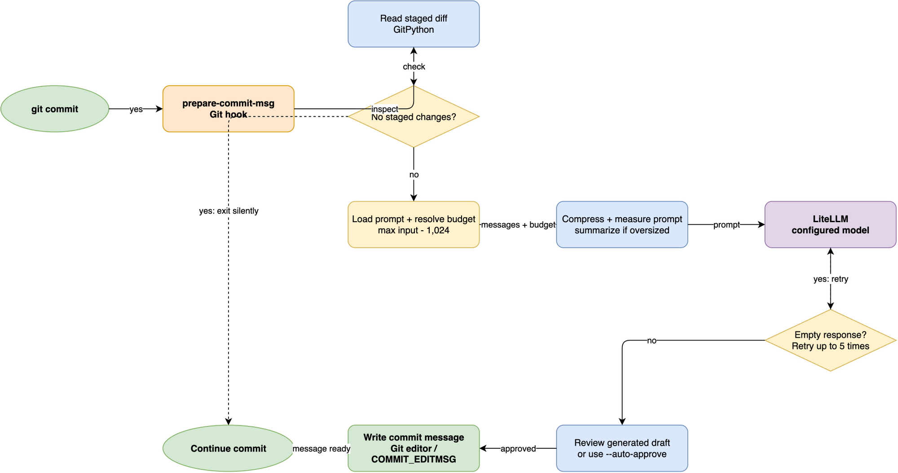

`ai-prepare-commit-msg` sits in Git's `prepare-commit-msg` lifecycle
and turns staged changes into a draft commit message.
The design stays simple:
Git continues to own the commit,
while the tool proposes the message and leaves final approval to you.

## What happens at commit time

Git runs the hook before the message editor opens.
At that point the tool:

1. Reads the staged diff from the repository.
2. Builds the prompt using the configured YAML template and the staged content.
3. Checks whether the request is too large for the current model budget.
4. Optionally compresses or summarizes the diff.
5. Calls LiteLLM with the final prompt.
6. Validates the model output and retries on empty responses.
7. Writes the generated draft into Git's `COMMIT_EDITMSG` file.

## Runtime flow

The execution path is intentionally small and predictable.
The CLI reads staged data,
constructs a prompt,
delegates the request to LiteLLM,
and writes the approved text back to Git.

The key safety checks are:

- no staged changes: exit silently
- oversized prompt: compress or summarize before sending
- empty response: retry within the configured limits
- no interactive terminal: require `--auto-approve` or fail

This keeps the hook useful in both local developer workflows and scripted automation.

## Prompt construction

The default prompt file declares the output contract.
It tells the model to produce a Conventional Commits-aligned message,
with a concise imperative summary and optional body text.
The runtime code injects the actual staged diff as the user message,
so policy and content stay separate.

The user prompt is intentionally narrow:
commit messages are generated from the diff,
not from whole-project context or unrelated repository metadata.

## Why LiteLLM is the boundary

LiteLLM provides a common interface for multiple model providers.
The hook does not care whether the backend is OpenAI, Anthropic, GitHub Copilot,
or a custom gateway.
It only needs a model identifier and a working provider configuration.

That design also keeps provider-specific logic outside the project.
Custom providers can be registered through the `ai_prepare_commit_msg.litellm_providers` entry point group,
which is documented in [Add a custom LLM provider](../how-to-guides/custom-providers.md).

## Why prompt optimization exists

The hook is designed for normal developer use,
but staged diffs can be large.
A large raw diff increases cost and can exceed a model's context window.
The project therefore includes two optimization layers:

- optional prompt compression via Headroom
- deterministic summarization for oversized diffs

Those steps are described in the companion pages:

- [Headroom prompt compression](headroom-integration.md)
- [Large diff summarization chain](summarization-chain.md)

## Output and approval model

The generated result is a draft, not a forced commit message.
When a terminal is available, the hook displays the message and waits for approval before writing it.
When automation is running without a terminal,
the user must explicitly opt into `--auto-approve`.

This gives a clean boundary between suggestion and final commit authoring.

## Failure handling

The hook treats empty or unusable model output as recoverable data loss,
not as success.
It retries on transient failures and stops cleanly when the model cannot produce a valid message.

That keeps the commit flow safe:
no blank message writes silently into Git, and no large diff is sent without a guardrail.

## Related

- [Configuration reference](../references/configuration.md)
- [Headroom prompt compression](headroom-integration.md)
- [Large diff summarization chain](summarization-chain.md)
