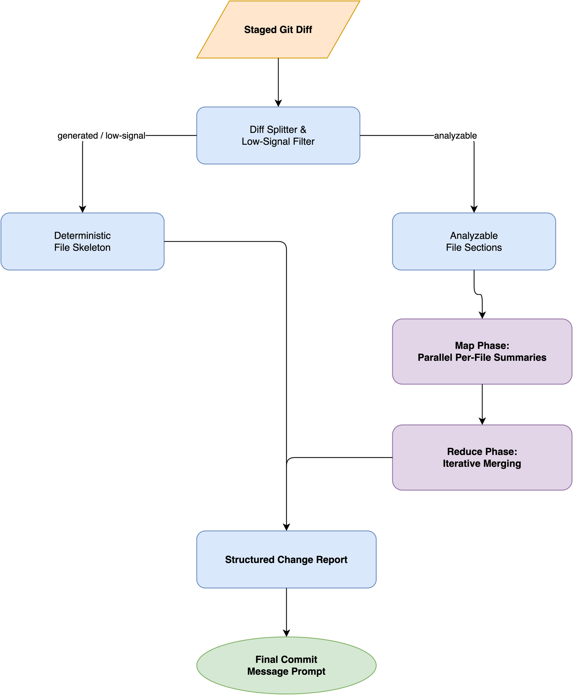

# Large diff summarization chain

When staged Git diffs grow too large for a single prompt,
`ai-prepare-commit-msg` uses a deterministic map-reduce summarization chain
to compress the changes into a structured change report.

This article explains why this strategy is needed,
how the map and reduce stages operate,
and how the pipeline protects the model from hallucination and token exhaustion.

## Why naive diff handling fails

Large pull requests and feature commits often introduce hundreds or thousands of changed lines across dozens of files.
Passing raw, oversized diffs directly to a language model fails in three distinct ways:

1. **Context window overflow**:
   Even models with large context windows have cost and prompt budget boundaries.
   A large diff can easily exceed the project's preflight limit (`MAX_PROMPT_TOKENS = 120_000`),
   triggering request rejection.
2. **Attention dilution**:
   When multiple large files share a single prompt,
   changes in massive generated files or verbose data structures starve smaller,
   critical logic changes of model attention.
3. **Truncation blind spots**:
   Naively truncating diff text at a fixed token or byte count silently drops files that appear later in the changeset,
   leading to commit messages that ignore critical subsystems.



## Deterministic anchoring and noise filtering

Before invoking any model call,
the pipeline performs two deterministic preprocessing steps:

### Low-signal path detection

Many diffs are dominated by machine-generated files,
such as lockfiles (`package-lock.json`, `poetry.lock`, `Cargo.lock`),
vendored directories (`node_modules`, `vendor`),
and compiled bundles (`.min.js`, `.pb.go`).

These files inflate diff size without conveying architectural intent.
The function `_is_low_signal_path` identifies these files by name,
directory,
or suffix,
and marks them as `[generated; not analyzed]`.
This preserves knowledge that the file changed
while saving LLM calls.

### Diff stat anchoring

To prevent the model from inventing files or hallucinating modification types,
`_file_change_stat` inspects diff headers directly:

- Parses `diff --git` headers to extract exact post-image file paths.
- Detects the modification mode (`added`, `deleted`, `renamed`, `binary`, or `modified`).
- Counts added (`+`) and removed (`-`) lines directly from patch chunks.

The resulting deterministic skeleton anchors the final summary with verified ground truth:

```text
Files changed:
- src/auth.py (modified, +15/-3)
- poetry.lock (modified, +120/-45) [generated; not analyzed]
- tests/test_auth.py (added, +48/-0)
```

## The Map phase: Parallel per-file analysis

Analyzable files are isolated and processed in the map stage:

1. **Token chunking**:
   Files that exceed `SUMMARIZATION_CHUNK_TOKENS` (`MAX_PROMPT_TOKENS // 6`, or 20,000 tokens)
   are split into numbered sub-chunks (`part X/Y`) across line boundaries.
2. **Per-file isolation**:
   Each file or chunk is submitted as an independent completion request with a focused system prompt.
   The prompt instructs the model to describe changes in 1–3 short bullet points,
   explicitly naming functions,
   classes,
   and constants modified.
3. **Concurrent execution**:
   `_map_file_summaries` dispatches requests using a thread pool with up to 4 concurrent workers,
   bounded by a 120-second global timeout.
   If the timeout expires,
   the chain proceeds using whatever partial summaries have completed.

Isolating each file prevents verbose files from crowding out concise changes in adjacent files.

## The Reduce phase: Iterative merging

Once individual file summaries are collected,
their combined text may still exceed the summarization token budget.

The reduce phase (`_reduce_summaries`) condenses the notes iteratively:

- Evaluates the total token count of the combined notes.
- If the text exceeds `SUMMARIZATION_CHUNK_TOKENS`,
  splits the notes into budget-sized chunks and prompts the model to consolidate redundant points while preserving unique details.
- Repeats for up to `MAX_SUMMARIZATION_ROUNDS = 3` until the summary fits within budget.

## Report assembly and graceful fallback

The final output produced by `_summarize_diff` merges the deterministic skeleton and semantic change notes:

```text
Files changed:
- src/ai_prepare_commit_msg/llm.py (modified, +85/-12)
- tests/test_llm.py (modified, +42/-4)

What changed:
- src/ai_prepare_commit_msg/llm.py: Added map-reduce summarization chain for oversized diffs.
- tests/test_llm.py: Added unit tests covering diff splitting, chunking, and reduce rounds.
```

This compact report replaces the raw diff in the prompt sent to the primary model for commit message generation.

If summarization fails completely,
the system falls back to the original diff.
If the overall prompt still exceeds the maximum token allowance,
the tool emits `OVERSIZED_DIFF_WARNING` and skips generation safely,
allowing the developer to write the message manually without crashing the Git hook.
